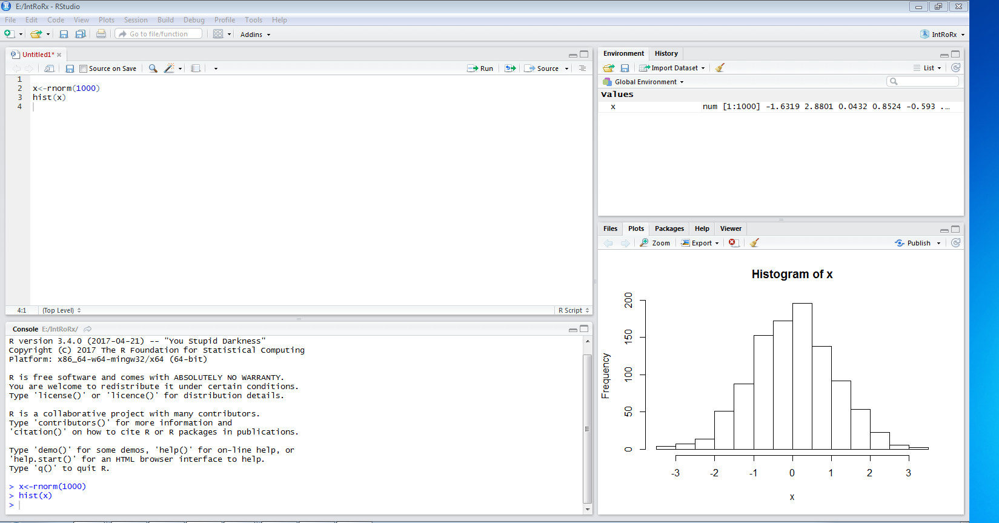
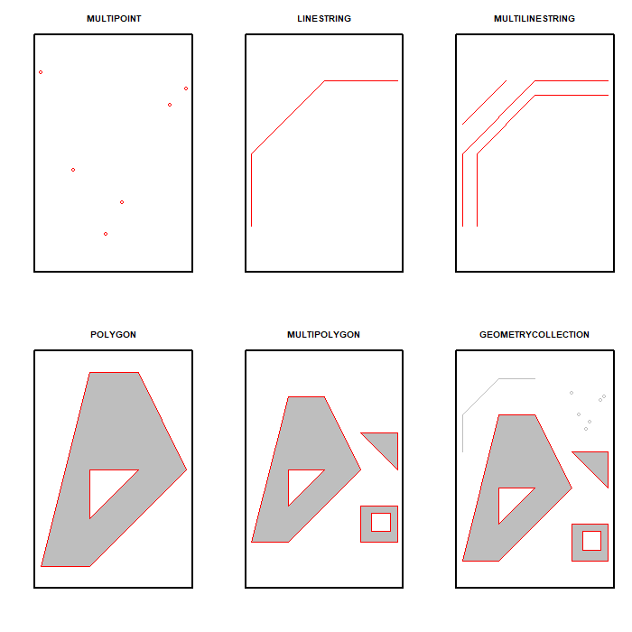

```{r setup, include=FALSE}
knitr::opts_chunk$set(echo = TRUE)
```

# Learning objectives

This one day course provides an introduction to R for beginners. Course participants will learn the following:

* Familiarise with the R/RStudio interface, 

* Able to import various data formats into the R Workspace, 

* Perform common data manipulation/transformation task using base R and dplyr, 

* Perform basic descriptive data analysis,

* Plot graphics/visualisation using base R and ggplot2 functions

# Introduction

## R and RStudio

R is a free open source environment for statistical computing and graphics. It runs on most platforms - UNIX platforms, Windows and Mac OS. R can be download at <https://cran.r-project.org/>. One can use R alone or with an interface like Rstudio - an IDE (integrated Development Environment) which runs on top of R. RStudio provides a rich user interface when compared to R and makes R more accessible and easy to use. RStudio can be downloaded at <https://www.rstudio.com/>. After installing both R and RStudio, you only need to run RStudio.

This document, [A (very) short introduction to R](https://cran.r-project.org/doc/contrib/Torfs+Brauer-Short-R-Intro.pdf), offers a very good introduction - from installation, getting you started and more.


## Why use R?

### Pros

* R is open source and free under [GNU General Public License](https://www.r-project.org/Licenses/).

* It is available on all common platforms.

* It is supported by an active community of users across most scientific disciplines - academia and industry.

  * There are many user contributed packages by experts from various scientific disciplines.
  
  * New technology and ideas are often first implemented in R and readily available.
  
* It is a flexible programming language.

  * It can handle most statistical computations, GIS mapping, building interactive web applications, e.t.c.

* Easy integration with other programs.

### Cons

* R is renowned for a steep learning curve.

* All objects are stored in the computer memory and can use all the available memory.

* Can be slower than compiled languages.

* Easy to make mistakes, difficult to find the sources of mistakes.

* While there is community support, there is no one to complain if something doesn't work.


## Some useful R Resources

There are many useful online resources for learning R and below is a list of some of these in the form of manuals, books, tutorials, presentations and blogs in no particular order.

* The R manuals (https://cran.r-project.org)

* Quick-R [homepage - statmethods.net](https://www.statmethods.net/) - - a good place to start learning R and an easily accessible reference.

* UCLA [website](https://stats.idre.ucla.edu/r/)

* An Introduction to R [(Venables and Smith 2014)](https://cran.r-project.org/doc/manuals/R-intro.pdf)

* [R for Data Science](https://r4ds.had.co.nz/), [@wickham2016r]

* [Cookbook for R](http://www.cookbook-r.com/)

* [CRAN Task Views](https://cran.r-project.org/web/views/) - links to packages grouped by topic.

* And many more materials, some acknowledged at the end.

# Getting Started with R/RStudio

## RStudio interface

When you open RStudio for the first time, three panels will appear. However, there are four standard panels that shows when you open, for example, an R Script, as shown below. 



**Basic layout**

Four panels and several tabs
      
* **Top-left** - the R script where you type source code, like the script editor in Stata.
  
* **Bottom -left** - is the console, where you see what R is doing. Commands can be entered directly or sent from the script pane (e.g., control/command + enter)
  
* **Upper- right** - has the following tabs:
  
  * *Environment*: Lists objects in the workspace (e.g., data you've created or imported)
  
  * *History*: list of commands run on console.
  
  * *Tutorial*: for integrated tutorials powered by the `learnr` package.
  
*  **Bottom right** has the following tabs:

    * *Files*: quick access to files in your working directory
  
    * *Plots*: View current and previous plots you've created
  
    * *Packages*: Helps with checking, loading and installing packages
  
    * *Help*: Show built-in help and allow searching for help
    
    * *Viewer*: displays local web content such as web graphics generated by some packages.
    


## Managing the workspace

### Commands

Most base R commands adopt the following syntax:

`> command(argument1, argument2, ...,)`

Any base R command needs to be followed by brackets. Using RStudio, you can either type your commands at the console and press enter or type in the script editor (`Menu -> New File -> R Script`) and press the Run button to the top right corner of the same window. Alternatively, selected/highlighted parts of an R script file can be run by pressing `Ctrl + Enter` and the whole script can be run by pressing `Ctrl + Alt + R`.

### Set working directory 

One can check or change the working directory in Rstudio (Session) using the following commands:

* Check current working directory 

```{r, eval=FALSE}
getwd()
```

* Set another working directory

```{r, eval=FALSE}
setwd("path/to/directory") 
```

### Install (and load) libraries

Often times you will find that you may need to use functions from other user-written packages or libraries. Since these packages do not come installed in base R, you need to do the additional installation by yourself. To install a package called `lattice`, type the following on your R console (and `Enter`) or script file (and `Run`):

```{r, eval=FALSE}
install.packages("lattice")
```

Developers of these packages usually update them after introducing new functions or even changing names of certain functionality and therefore one might need to keep track of these changes or be aware that it can happen.

You also need to load the package/library into the R workspace before you can use functions from that library as follows:

```{r, eval=FALSE}
library(lattice)
```
You need to load the library each time you need to use it in a new R session.

### Comments in R

`#` denotes a comment in R, e.g.

```{r, eval=FALSE}
# Check current working directory 
getwd()
```
    
Anything after the `#` is not evaluated and ignored in R


### Getting help

There are several functions for getting help in R as described [here](https://www.r-project.org/help.html), but I have mostly used the following:

* `help(solve)` or `?solve` - to get help for command `solve`, type:

  * this is useful only if you already know the name of the function that you wish to use.
  
* `help.search("solve")`  and `??solve` - scans the documentation for packages installed in your library for commands which could be related to string solve

* `help.start()` - Start the hypertext (currently HTML) version of R's online documentation.

* For tricky questions, error messages and other issues, use [Google](https://www.google.com/) (include "in R" to the end of your query).

* [StackOverflow](https://stackoverflow.com/) - great resource with many questions for many specific packages in R and a rating system for answers

## Operators in R

### Basic arithmetic operators

All basic mathematical operations are the same in R as it is in other languages (using the `+`, `-`, `*`, and `/` operators)

```{r, echo=T}
2 + 3 # Addition
7 - 4 # Subtraction
3 + 5 * 2 # Multiplication
(3 + 5) * 2 # Multiplication with brackets 
#Maths ops follow the normal order of operations.
7/3 # Division
5^2 # Power
```

We can also use modulo operators (integer division & remainder).

For example.

```{r}
150 %/% 60 ## E.g. whole hours in 150 minutes

150 %% 60 ## Minutes left over
```

Functions like `exp()`, `log()` and `sqrt()` also exist.

### Assignment operator

`<-` is the assignment operator, it declares something is something else. For example, we can assign `x` to be 3 as follows:

```{r, echo=T}
x <- 3
x
```

### Sequence operator

`:` is the sequence operator. To get the sequence of numbers/integers from 1 to 10, type the following:

```{r, echo=T}
a <- 1:10 # it increments by one
a
```

## Managing the workspace (more functions)

As we creating more objects in the workspace, we also need to be able to manage and manipulate the 'workspace'. All the R objects that we have created are stored in the memory of the computer and sometimes the unnecessary objects in the workspace can use a significant amount of the memory. R makes organizing the workspace easy. Lets create a few more objects and show how to remove some of these from memory:

```{r}
z <- 10
```

We can list or ask R to display all the objects in memory using the `ls()` function:

```{r}
ls()  #list all variables
```

Assuming that we no longer need object `x` in the workspace, we can remove it from memory using the `rm()` function:
 
```{r}
rm(x)  # delete a variable
```

We can list again all the objects in memory and confirm that `x` has been removed.

```{r}
ls()
```

We are now left with objects `a` and `z`.

We can also remove specific objects, `a` and `z` by typing the following:

```{r}
rm(x,y)
```

* To remove everything in the workspace

```{r}
rm(list = ls())
```

## Some language features

It might be helpful to be aware of the following R features:
 
* R is inconsistent in it's naming conventions

    * Some functions are `camelCase`; others are `dot.separated`; others `use_underscores`.
  
* Function results are stored in a variety of ways across function implementations.
    
* R has multiple graphics packages that different functions use for default plot construction (base, grid, lattice, and ggplot2)
    
* R has multiple packages and functions to perform the same tasks.
    
* Be flexible and be aware of R's flexibility

## Objects

Everything in R is an object and even including functions. The next section introduces some common types of objects. But before we move to the next section, we do the following practice question on assignments and operators.

## Practice - assignment and operators

1. Assign the following variables for an individual whose `height` is 175cm and `weight` is 80kg.

```{r, eval = FALSE}
height <- 

weight <- 
```

2. Calculate their BMI assuming the variables defined above and the BMI formula below: 

$$BMI = \frac{weight(kg)}{height(m)^2}$$
```{r, eval = FALSE}
bmi <- 
```

# Data types and structures

## Data types

* R has five basic or "atomic" classes of objects:

  * **logical** (e.g., TRUE, FALSE)
  
  * **integer** (e.g., 2L)
  
  * **numeric** (real or decimal) (e.g, 2, 2.0, $\pi$)
  
  * **complex** (e.g, 1 + 0i, 1 + 5i)
  
  * **text** or **character** (e.g, "this text", "any text")
  
## Data structures

* R also has many data structures and these include:

  * vector
  
  * list
  
  * matrix
  
  * data frame
  
  * factors
  
  * tables
  
* We will go through some of these

## Vectors

### Vector

* A vector is the most common and basic data structure in `R`

* Vectors can be of two types:
  
  * atomic vectors
  
  * lists
  
### Atomic vectors

* can be a vector of characters, logical, integers or numeric.

* The `c()` function can be used to create vectors of objects.

```{r}
#logical
v_log <- c(TRUE, FALSE, FALSE, TRUE) 
v_log

#integer
v_int <- 1:4 
v_int

#numeric double precision
v_doub <- 1:4 * 3.14
v_doub

#character
(v_char <- c("a","b","c","d"))
#note -  I enclosed in brackets to print on screen
```


* Each atomic vector has the same type of elements

#### Check vector type

* use `is.*()` functions to confirm vector type

```{r}
is.numeric(v_doub)
is.integer(v_doub)
```

* It is also possible to ask R using the class function - `?class`

```{r}
class(v_doub)
```

#### Explicit coercion

*  It is easy to convert from one vector type to another type.

*  For explicit coercion, use the `as.*()` functions.

```{r}
v_log
as.integer(v_log)
v_int
as.numeric(v_int)
v_doub
as.character(v_doub)
as.character(as.numeric(as.integer(v_log)))
```

### Mixing objects

* What happens when a vector consists of multiple data types?

```{r}
x <- c(1.7, "a") ## numeric + character
class(x)
y <- c(TRUE, 2) ## logical + numeric
class(y)
z <- c("a", TRUE) ## character + logical
class(z)
```

* Coercion occurs so that every element in the vector is of the same class.

* Hierarchy of types: the more primitive ones silently convert to those higher up.

* The order is:
  1. logical
  2. integer
  3. double
  4. character


### Some special numbers

* There is also a special number `Inf` which represents infinity; 

  * e.g. 1/0

```{r}
1/0
```

* The value `NaN` represents an undefined value ("not a number"). 

    * e.g. `0/0`
    
```{r}
0/0
```

### Index a vector
  
* to select specific elements or atoms.

* elements of a vector have an index or position number.

* index using square brackets - `object[index]`.

* there are several ways to express which elements you want.


**Logical vector**

  * logical vector: keep elements of `x` for which the index is `TRUE` and drop elements for which the index is `FALSE`.
  
  * remember vectors created previously.

```{r}
v_log <- c(TRUE, FALSE, FALSE, TRUE) #logical
v_int <- 1:4 #integer
v_doub <- 1:4 * 3.14 #numeric double precision
v_char <- c("a","b","c","d") #character
```

* filter elements 3 and 4 from the character vector `v_char`.

```{r}
v_char[c(FALSE, FALSE, TRUE, TRUE)]
```

* filter character vector `v_char` based on the logical vector `v_log`.

```{r}
v_char[v_log]
```


**Positive integer vector**: the elements specified in the index are kept, e.g., the 2nd and 3rd.

```{r}
v_doub[2:3]
```

**Negative integer vector**: the elements specified in the index are dropped.

```{r}
v_char[-4]
```

## Factors

* Factors are used to represent categorical data. 

* Factors can be unordered or ordered. 

* Factors are stored as integers where each integer has a label associated with it.

* When a character vector is converted to a factor, by default, R sorts levels in alphabetical order.

* A factor is a very special and sometimes frustrating data type in R

* Factors can be created using the `factor()` command. Let us create a character vector, `v_char`, and convert to a factor, `v_fac`:

```{r}
v_char <- c("Medium","High","Low") # character vector
v_char
v_fac <- factor(v_char) # factor variable
v_fac
```

* Using the `levels` command, we can see that levels of the above factor are in alphabetical order of "High", "Low", "Medium".

```{r}
levels(v_fac)
```

* Factors are of class `factor`.

```{r}
class(v_fac)
```

* What is happening under the hood?

```{r}
unclass(v_fac) # In alphabetical order: "Medium=>3,High=>1,Low=>2
```

* What if we don't want the default ordering? For example, if you want a lower value for the baseline level in regression, plot ordering, e.t.c.

#### Ordering the factor

* It may be more meaningful to maintain the order "Low", "Medium", "High"

* The order of the levels can be set using the `levels` argument to `factor()`. 

* This can be important in linear modelling because the first level is usually used as the baseline level (another option is to use the function `relevel()`).

```{r}
v_fac_ord <- factor(v_char, levels = c("Low", "Medium", "High"), ordered = TRUE)
#v_fac_ord <- ordered(v_char, levels = c("Low", "Medium", "High"))
v_fac_ord
unclass(v_fac_ord) 
```


* Factors can also be created from numeric vectors. 

* Assume we have a vector of `1`s and `0`s where 1 represents the presence of some outcome and 0 otherwise. The code below shows how to create a labeled factor from the vector.

```{r}
v_indicator <- c(1, 0, 1, 1, 0, 0,1)

v_fct <- factor(v_indicator,
                levels = c(0, 1),
                labels = c('No', 'Yes'))

summary(v_fct)
```

#### Converting factors

* Converting from a factor to a number can cause problems:

```{r}
f <- factor(c(1, -9, 2))
as.numeric(f)
```

* It returns factor levels and this is not what we wanted (and there is no warning).

* The recommended way is to use the integer vector to index the factor levels:

```{r}
levels(f)[f] 
```

* to get the numeric values

```{r}
as.numeric(levels(f)[f])
```

* Or less effecient

```{r}
as.numeric(as.character(f))
```

#### Dropping fevels

* When you want to drop unused factor levels, use `droplevels()`:

* Lets say you have no observations in one level - "Medium"

```{r}
v_fac_ord <- v_fac_ord[v_fac_ord != "Medium"]
summary(v_fac_ord)
```

* You can drop that level if desired - e.g. if you want to plot without dropping the level, the category will show up.

```{r}
f_var_new<-droplevels(v_fac_ord)
summary(f_var_new)
```

## Matrices

* **Matrices** are vectors with dimensions - number of rows and columns. 

* All rows and columns are of the same length and data type, e.g.,

```{r}
m <- matrix(1:12, nrow = 3, ncol = 4)
m

dim(m)
#Same as:
attributes(m)
```

* In R, matrices are by default constructed column-wise.

* This can be changed by specifying the `byrow` option.

## Lists

* **lists** are arbitrary combinations of disparate object types in R.
  
* The objects do not have to be of the same type or same element or same dimensions.

```{r}
my_list <- list(v_char = c('A', 'B'),
                v_num = c(1, 3.5, 8, 15.91),
                v_comp = 1 +4i,
                v_list = list(c(1L, 2L), c(TRUE, FALSE, FALSE)))

my_list
```

---

## Data Frames

* Data frames are used to store tabular data.

* They are represented as a special type of list where every element of the list has to have the same length.

* Each element of the list can be thought of as a column and the length of each element of the list is the number of rows.

* Unlike matrices, data frames can store different classes of objects in each column (just like lists);
  
  * Matrices must have every element be the same class
  
* Data frames also have a special attribute called `row.names`

* Data frames can be created using the `data.frame()` function.

* Can also import external tabular text data using `read.table()` or `read.csv()` into a data frame.

* Can be converted to a matrix by calling `data.matrix()` or `as.matrix()`


### Exploring data frames 

Here, we demonstrate some functions for handling data frames using an in-built data set called `iris`. We will introduce functions for importing your own data later on, but for now we will call the `iris` data frame using the `data()` function as follows:

```{r}
data(iris)
```

We start by demonstrating functions for showing a few of the observations in a data frame. 

The `head()` function shows the first few rows of the data frame. The default number of rows is 6, but this can be changed. 

```{r}
head(iris)
```

The `tail()` - function shows the last few rows of the data frame. Again, the default is 6 rows.

```{r}
tail(iris)
```

`dim()` - see dimensions, i.e., number of rows and columns

```{r}
dim(iris)
```

`nrow()` - number of rows 

```{r}
nrow(iris)
```

`ncol()` - number of columns 

```{r}
ncol(iris)
```

`str()` - structure of each column 

```{r}
str(iris)
```

`names()` - will list column names for a `data.frame` (or any object).

```{r}
names(iris)
```

# Handling data in R      

## Missing values

* denoted by `NA` and/or `NaN` for undefined mathematical operations.

* `NA` values have a class. So you can have both an integer `NA` and a missing character `NA`.

* `NaN` is also `NA`. But not the other way around.

**Example 1**

* Example `x` vector

```{r}
x <- c(1, 2, NA, 10, 3)
```

* Check elements of `x` that are `NA`

```{r}
is.na(x) # returns logical
```

* Check elements of `x` that are `NAN`

```{r}
is.nan(x)
```

* All `FALSE`

**Example 2**

* Another example vector

```{r}
x <- c(1, 2, NaN, NA, 4)
```

* Check elements of `x` that are `NA`

```{r}
is.na(x)
```

* Check elements of `x` that are `NAN`

```{r}
is.nan(x)
```

## Relational operators

* The comparison operators `<`, `>`, `<=`, `>=`, `==`, and `!=` are used to compare values across vectors.

* Consider the following vectors:

```{r, echo=T}
big <- c(9, 12, 15, 25)
small <- c(9, 3, 4, 2)
```

* Check cases where big is greater than small

```{r, echo=T}
big > small
```

* This returns a vector of logical values

* How about big equal to small?

```{r, echo=T}
big = small
```


* this reassigns big to small, and this not what we wanted. We wanted cases where big is equal to small

```{r, echo=T}
print(big)
print(small)
```

* Safer to assign using `<-` than comparison operators, `=` or `==`.

* The best way to evaluate these objects is to use brackets `[]` to avoid confusion.

* Lets first correct the `big` vector.

```{r, echo=T}
big <- c(9, 12, 15, 25)
```

* To get elements of big such that big is equal to small we do the following:

```{r}
big[big == small]
```

* The command returns values of "big" where the logical vector created inside the square bracket is true.

* More examples ...

```{r, echo=T}
big[big > small]
```

```{r, echo=T}
big[big < small]  # Returns an empty set
```

## Logical operators

* Construct complex condition using logical operators such as, (AND) `&`, (OR) `|` and (NOT) `!`.

* Referring back to vectors `small` and `big`

**AND**

* The `&` operator represents the logical **AND** operation. It returns `TRUE` if both conditions on the left and right of `&` are TRUE.

```{r}
small>=9 & big<14
```

* To get elements of `big` that match the `&` condition

```{r}
big[small>=9 & big<14]
```

**OR**

The `|` operator represents the logical **OR** operation. It returns `TRUE` if either one of the conditions on the left and right of `|` are TRUE.

```{r}
#|
small>=9 | big<14
```

* To get elements of `big` that match the `|` condition

```{r}
big[small>=9 | big<14]
```

**NOT**

* Assume we have a vector `x` as follows:

```{r, echo=T}
x <- c("a", NA, 4, 9, 8.7)
!is.na(x)  # Returns TRUE for non-NA
```

```{r, echo=T}
class(x)
```

* Using the logical vector to subset `x`

```{r, echo=T}
x1 <- x[!is.na(x)]
x1
```

```{r, echo=T}
class(x1)
```

# Importing and exporting data

## Data sources

The data that we usually want to analyze in R come in different file formats and from different sources that includes:

* Built in Data (+ data in packages)
* Formatted text: .csv, .txt, .xls
* Specialised software: e.g. SPSS, SAS, Stata
* Databases
* Web Scraping

## Built in Data

Many packages in R have built in data. Authors of the packages use this data to demonstrate functions in their packages. This data can be a great resource for demonstrating other use cases. To check what data you have in R, run the following command:

```{r, eval = FALSE}
data()
```

An **"R data sets"** window will pop up on the top left pane and display a list of the data as well as what packages the data is in.

It is also possible to call data from a specific package, e.g. data from the `datasets` package.

```{r, eval = FALSE}
data(package="datasets")
```

To load a specific built-in dataset, e.g. the `iris` data, type the following:

```{r}
data(iris)
```

## Native R data formats

R has two native data formats - `.RData` and `RDS`. These formats are used when R objects are saved for later use. `RData` is used to save multiple R objects, while RDS is used to save a single R object.

We can load the `demo_data.RData` data set in the `data` subfolder. 

```{r}
load("./data/demo_data.RData")
str(my.df)
```

We can save this data set, `my.df` and the `iris` dataset to `demo_data1.RData` as follows:

```{r}
# save specific objects to a file
save(my.df, iris, file = "./data/demo_data1.RData")

# save the whole workspace to the file .RData in the current working directory (cwd)
#save.image()
```

## Text delimited format

Text delimited file format is one of the common formats in which data is shared. The most common ones are comma separated (csv) or a tab delimited file. There are several functions that can read these data into R. 

### Base R functions

* We can import `.csv`/`.txt` data using the `read.table` function from the base R `utils` package.

* The `read.table` function is the general function for reading text formatted data. It also has the following variants:

    * `read.csv` - for reading standard CSV

    * `read.csv2` - for reading fields separated by a semi-colon

    * `read.delim` - for tab delimited files where by default, point (".") is used as decimal point

    * `read.delim2` - for tab delimited files where by default, comma (",") is used as decimal point

* The default arguments of the `read.csv` function are as follows:

```{r, echo=FALSE, comment=''}
str(read.csv)
```

* `file` - name of file to read/import

* `header` - a logical value indicating whether the file contains the names of the variables as its first line. Default if `TRUE`

* `sep` - the field separator character. default is ","

* `quote` -  the set of quoting characters

* `dec` - the character used in the file for decimal points

* Here we assume these defaults and only specify the `file` path as follows:

```{r}
my.df <- read.csv(file = "./data/demo_data.csv")
head(my.df)
```

* The CSV file is in the `data` sub directory of the parent working directory

* We only need to use the relative path when referring to a subdirectory of the working directory

* The corresponding function for saving to CSV is `write.csv()`.

```{r, eval=FALSE}
write.csv(my.df, "./data/demo_data_new.csv")
```

### **readr** package functions

* The `readr` package is part of the `tidyverse` and contains a number of functions for importing data into R.

* It has its own version of the base R functions described above - `read_csv`, `read_delim`

* `read.csv` and `read_csv` behaves in similar fashion, with a few notable differences:

  1. `read.csv()` stores data as a `data.frame`, where as `read_csv()` stores data as a `tibble`. **Tibbles** are data frames, but they tweak some older behaviours to make life a little easier.
    
  2. `read.csv()` coerces column names with spaces and/or special characters to different names
    
  3. The `read_csv()` function loads faster and offers some advanced features compared to `read.csv` 

* To use functions within packages, we first need to load the package/library. To load the `readr` package:

```{r, message=FALSE, warning=FALSE}
library(readr)
my_df <- read_csv(file = "./data/demo_data.csv")
head(my_df)
```

* The corresponding function for saving to CSV is `write_csv()`.

```{r, eval=FALSE}
write_csv(my_df, "./data/demo_data_new.csv")
```

### **data.table** package

* There is also the `data.table` package that has a function named `fread()`. This function works faster than both `read.csv()` and `read_csv()`.

## MS Excel format
 
* There are several packages for importing data from MS Excel such as **gdata**, **RODBC**, **XLConnect**, **RExcel**, **readxl**.

* The **readxl** package, a member of the `tidyverse`, fulfills most of basic requirements for importing Excel files into R.

* The **readxl** package contains two import functions - `read_excel()` and `excel_sheets()`.  `read_excel()` allows you to import an excel file into R and `excel_sheets()` allows you to read different sheets present within the excel book.

* The **readxl** package can import both the old formatted ".xls" files and the latest formatted ".xlsx".

## Specialiased statistical software - SAS, SPSS, Stata

**haven** package

The `haven` package has functions for importing data files from various statistical software systems. This package support SAS, Stata and SPSS software. We can use the following functions to import different file format into R:

* STATA: `read_dta()` or `read_stata()` - the two functions are identical

```{r, eval=FALSE}
library(haven)
#import
stata_df <- read_dta("./data/demo_data.dta")
#export
write_dta(stata_df, "./data/demo_data.dta")
```

* SAS: `read_sas()`

```{r, eval=FALSE}
#import
sas_df <- read_sas("./data/demo_data.sas7bdat")
#export
write_sas(sas_df, "./data/demo_data.sas7bdat")
```

* SPSS: `read_sav()` or `read_por()`. 

```{r, eval=FALSE}
#import
spss_df <- read_sav("./data/demo_data.sav")
#export
write_sav(spss_df, "./data/demo_data.sav")
```

**foreign** package

There is also the foreign package, an older base R library for importing  SAS, Stata and SPSS file formats. The `haven` package introduced above is an improvement to the foreign package. The foreign package functions for importing the various file formats are:


* STATA: `read.dta()`
* SPSS: `read.spss()`
* SAS file format are a bit more complicated to import with the `foreign` package

For the packages introduced above, you can read more from the package websites:

R manuals: [R Data Import/Export](https://cran.r-project.org/doc/manuals/r-release/R-data.html)

[readr package page](https://readr.tidyverse.org/)

[data.table vignettes](https://cran.r-project.org/web/packages/data.table/vignettes/)

[readxl package page](https://readxl.tidyverse.org/)

[haven package page](https://haven.tidyverse.org/)

You can check more on R packages for data import and other functions from the following blogs:

[Garrett Grolemund - Quick list of useful R packages](https://support.rstudio.com/hc/en-us/articles/201057987-Quick-list-of-useful-R-packages)

[Sharon Machlis - Great R packages for data import, wrangling, and visualization](https://www.computerworld.com/article/2921176/great-r-packages-for-data-import-wrangling-visualization.html)

# Manipulating data

## Data frame manipulation with base R functions

### Data

Here we are going to import the `demo_data.csv` file, a fictional data that we just introduced above.For now, we are going to stick to base R functions.

```{r}
my_df<-read.csv("./data/demo_data.csv")
```

We are going to make use of some of the functions introduced in the previous sections. We can use the `head()` function to return the first 10 elements or observations

```{r}
head(my_df, n=10L)
```

Since I created this data, this can be seen as individual level information. Individuals are identified by the `hhid`(Household ID) and `pid`(Person ID). There is also information about their `age`, some grouping variable (`grp`) and two sources of income, `inc1` and `inc2`.

By visual inspection, we can see that `pid` 1 from `hhid` 3 has missing `inc1`. To see the structure of each column or variable we use the `str()` function. 

```{r}
str(my_df)
```

* The `summary()` function returns basic descriptive statistics for each variable from the data frame.

```{r}
summary(my_df)
```

* We use the `names()` function to print names of all columns in the data frame. 

```{r}
names(my_df)
```

* `mean()` function calculates the mean of a vector

```{r}
#remember $
mean(my_df$age)
```

* **What happens with the mean for `inc1` which has some missing values**

```{r}
mean(my_df$inc1)
```

* R does not calculate the mean (or other summary statistics) when there are `NA`s in the vector

* We need to tell R to remove/ignore `NA`s before performing any computations by specifying the option, `na.rm=TRUE`

```{r}
mean(my_df$inc1, na.rm=TRUE)
```

* We do not necessarily need to specify `na.rm=TRUE` if the variable has no `NA`s

* More summary statistics - `sd`, `var`, `min`, `max`, `median`, `range` and `quantile`.

```{r}
sd(my_df$age) #standard deviation
var(my_df$age) #variance
min(my_df$age) #minimum
max(my_df$age) #maximum
median(my_df$age) #median
range(my_df$age) #range
quantile(my_df$age) #quantile
```

### Basic subsetting

* Subsetting is a way(s) to keep or delete variables and observations and to take random samples from a dataset.

#### Selecting (keeping) variables

* A data frame (`df`) is of the form, `df[rows, columns]`

* Therefore, the following specification evaluates if a vector of column names (`mycol`) is contained in the names of the data frame.

* `df[,mycol]`

* However, R thinks column-wise and the following also works since it defaults to evaluating columns

* `df[mycol]`

* We want to select variables `inc1`and `inc1`:

**Method 1**

* Using a vector of variable names 

```{r}
myvars <- c("inc1", "inc2")
newdata <- my_df[myvars]
#newdata <- my_df[c("inc1","inc2")]
head(newdata,5)
```

**Method 2**

* We can also use index position of column names

* For example, to select 3rd and 6th thru 7th variables:

```{r}
newdata <- my_df[c(3,6:7)]
head(newdata,5)
```

### Excluding (dropping) variables

**Method 1**

* Excluding columns works as above except that we need to negate(`!`) the condition

* To exclude variables `inc1` and `inc2`

```{r}
myvars <- names(my_df) %in% c("inc1", "inc2") 
newdata <- my_df[!myvars]
head(newdata,5)
```

`%in%` is used for value matching. It "returns a logical vector indicating if there is a match or not for its left operand." (See `help('%in%')`)


**Method 2**

* We can also use the column index position and negate (`-`)

* Exclude 6th and 7th variable

```{r}
newdata <- my_df[c(-6,-7)]
head(newdata, n = 5)
```

**Method 3**

* We can also use the `NULL` special function as follows:

```{r}
#my_df$inc1 <- NULL
```

### Selecting observations

#### square brackets

* We can select observations by the index of row numbers

* To select first 5 observations
 
```{r}
newdata <- my_df[1:5,]
newdata
```

#### A defined condition

* For example, to select rows where `grp ==‘C’` and `age` greater than 65

```{r}
newdata <- my_df[my_df$grp=='C'& my_df$age > 65, ]
head(newdata,5)
```

### Some data aggregation functions

Here we introduce built-in base R functions for data aggregation. They are known as the `apply` family of functions from the base package.

* these are vectorized functions compared to `for` loop.

* functions to manipulate slices of data from matrices, arrays, lists and data.frames in a repetitive way.

* helps to perform operations with very few lines of code.

* The family comprises: `apply`, `lapply` , `sapply`, `vapply`, `mapply`, `rapply`, and `tapply`.

* use depends on the structure of the data we wish to operate on, and the format of the output we need.

#### apply

* apply - applies a function to a matrix’s rows or columns (or, more generally, to dimensions of an array)

* apply is used to a evaluate a function (often an anonymous one) over the margins of an array.

```{r, echo=FALSE}
str(apply)
```

* `X` is an array
* `MARGIN` is an integer vector indicating which margins should be “retained.” For a matrix 1 indicates rows, 2 indicates columns.
* `FUN` is a function to be applied
* ... optional arguments to FUN

**Row sum - total individual income (`inc1` + `inc2`)**

To calculate row totals, the margin argument should be equal to 1

```{r}
apply(my_df[,6:7], 1, sum, na.rm=TRUE)
```

We can also create a new variable in the data frame and using the `$` sign:

```{r}
my_df$tot_inc<-apply(my_df[,6:7], 1, sum, na.rm=TRUE)
head(my_df, 12L)
```

**Column averages - mean income for each (inc1, inc2)**

* To calculate column average, the margin argument should be equal to 2

```{r}
apply(my_df[,6:7], 2, mean, na.rm=T)
```

There are also simplified base R functions to compute some column and row statistics. These are: `colSums()`, `rowSums()`, `colMeans()` and `rowMeans()`.

#### lapply and sapply

Assume we want to round `inc1` and `inc2` to 1 decimal place. Instead of rounding one variable at a time, we can use either of `lapply` or `sapply`. We also define our own function to round.

```{r}
lapply(my_df[6:7], function(x) round(x,1))
#my_df[6:7] <- lapply(my_df[6:7], function(x) round(x,1))
```

#### tapply

`tapply` is used to apply a function over subsets of a vector.

```{r}
str(tapply)
```

* `X` is a vector

* `INDEX` is a factor or a list of factors (or else they are coerced to factors)

* `FUN` is a function to be applied

* `...` contains other arguments to be passed to FUN

* `simplify` should we simplify the result?

* For example, to sum individual level income within households to total household income

```{r}
tapply(my_df$tot_inc, my_df$hhid, sum, na.rm=T)
```

#### Other related functions

* `ave`

* `aggregate`


## Data frame manipulation with `dplyr` functions

### What is dplyr?

So far, we have seen that R has most of the fundamental functions to manipulate data. However, the functions lacks consistent coding. Functions outputs do not always flow together such that in some cases you need to create interim objects before merging them back to the main data frame. Some would find the bracket notation difficult to read especially for complicated operations.

This is where `dplyr` comes in to provide consistent ways to manipulate data. One can chain operations such that you do not need to unnecessarily clutter your workspace with temporary files. The `dplyr` work-flow is considered intuitive to write and easy to read.

While this lesson introduces `dplyr`, it might be helpful to introduce the `tidyverse` as well.

### What is the `tidyverse`?

* `tidyverse` is a collection of modern R packages that share a common philosophy, embed best practices, and are designed to work together

* Most of the [tidyverse](https://www.tidyverse.org/) packages were created by Hadley Wickham.

* As indicated on the [tidyverse homepage](https://www.tidyverse.org/), "All packages share an underlying design philosophy, grammar, and data structures"

* The core `tidyverse` packages and their purpose are as listed below: 

#### Core tidyverse packages

* `ggplot2` - for data visualisation or creating graphics

* `dplyr` - for data manipulation using a consistent set of verbs. Regarded as the data wrangling workhorse*

* `tidyr` - for data tidying

* `readr` - for data import

* `purrr` - for functional programming

* `tibble` - for tibbles, a modern reimagining of data frames

* `stringr` - for string manipulation

* `forcats` - for solving common problems with factors

* There are also other important `tidyverse` packages for different functions as listed on the [tidyverse page](https://www.tidyverse.org/)

### Installation

* `dplyr` can be installed as a stand alone package or through the `tidyverse` package.

* To install `dplyr` as a stand alone package:

```{r, eval=FALSE}
install.packages("dplyr")
```

* To load `dplyr` into the workspace

```{r, message=FALSE, warning=FALSE}
library("dplyr")
```

* In some cases, the work-flow involves incorporating functions from the various `tidyverse` packages and installing all the `tidyverse` packages has been made easier by one function call as follows:

```{r, eval=FALSE}
install.packages("tidyverse")
```

* To load core `tidyverse` packages: 

```{r}
library("tidyverse")
```

### Fundamental `dplyr` verbs

* The `dplyr` package has five fundamental data wrangling verbs that works as follows:

  * `filter( )` - rows by their values

  * `arrange( )` - reorder rows

  * `select( )` - pick and/or exclude columns

  * `mutate( )` - create new columns

  * `summarize( )` - collapse rows with summaries
  
And any of the above may be extended over a group of rows with:

  * `group_by( )` - define groups based on categorical variables


#### Using dplyr functions

* `dplyr` function arguments for the verbs generally work as follows:

`verb(df, ...)`

* The first argument is the data frame to work on

* Following arguments define what to do on which named columns in the data frame. The result is always another data frame.

* This is unlike the Base R approach which forces you to repeat the data frame’s name each time you want to refer to a variable.

In this section, we explore some variables from a subsample of the [National Income Dynamics Study (NIDS)](https://www.datafirst.uct.ac.za/dataportal/index.php/collections/NIDS) data. You can find more about NIDS In the [link]((https://www.datafirst.uct.ac.za/dataportal/index.php/collections/NIDS)), but for now, it might be helpful to know that NIDS is a panel study of individuals in South Africa.The subset used in this course was created from the first wave conducted in 2008. Therefore, the sub-sample is for illustration purposes only and NOT the official data set. If you are interested in the full NIDS dataset, you can access it from the [DataFirst](https://www.datafirst.uct.ac.za/) website.

This subset has the following variables variables and the description is obtained from the study documents

```{r, echo=FALSE}
cat(readLines("./data/nids_subset_description.txt"), sep = '\n')
```

Now, we import the data set:

```{r}
nids_df <- read_csv("./data/nids_subset.csv")
```

Show data frame structure using `glimpse()`

```{r}
glimpse(nids_df)
```

### Arrange

* The `arrange()` function order rows by values of a column(s) in ascending or descending order.

* To re-order the `nids_df` first by `hhid` then `pid`, we type:

```{r}
arrange(nids_df, w1_hhid, pid)
```

* use `desc(variable)` to sort variable in descending order

**Questions:**

* Which household id (`w1_hhid`) has the oldest person?

### Filter

* The `filter` function extract rows that meet a logical criteria

* We can filter participants with age older than 100 as follows:

```{r}
filter(nids_df, w1_best_age_yrs>100)
```

* The first argument given to `filter` (and the other `dplyr` verbs) is always the data frame, followed by logical criteria that the returned cases must pass. In this example, the criteria is `w1_best_age_yrs > 100`. 

* It is also possible to include multiple criterias:

```{r}
filter(nids_df, w1_best_age_yrs>100 & w1_r_relhead==1)
```

It is also possibole to separate by `,` which is read as `&`

```{r}
filter(nids_df, w1_best_age_yrs>100, w1_r_relhead==1)
```

If you want the filter to pass at least one test, use the `|` operator:

```{r}
filter(nids_df, w1_best_age_yrs>100 | w1_r_relhead==1)
```

**Questions:**

* How many male household heads are in the `nids_df` data frame?

* How many female household heads aged under 16 are in the `nids_df` data frame? 

### Select

* The `select` function extract columns by name.

* We can select the `w1_hhid` and `pid` columns as follows:

```{r}
select(nids_df,w1_hhid,pid)
```


### Pipe 

* `%>%` is the pipe operator. 

* It takes what is on the left hand side and pushes it into the first argument of the right hand side.

* Piping or chaining commands is thought to increase readability when there are many commands. The `%>%` operator is imported automatically from the [magrittr](https://magrittr.tidyverse.org/) package 

* For example:

```{r}
nids_df %>%
  filter(w1_r_relhead==1 & w1_best_age_yrs>0) %>%  #filter
  arrange(w1_best_age_yrs) %>% #arrange
  select(w1_hhid, pid, w1_best_gen, w1_best_age_yrs)  #select
```

The above takes the `nids_df` data frame **and then** order/sort by `hhid` and `pid`, **then** select to keep their `hhid`, `pid` and `w1_r_best_age_yrs` columns, **then** filter to keep rows with age older than 65. In mathematical function notation, your can interpret the pipe as:

```{r, eval = FALSE}
x %>% f %>% g %>% h
```

Compare the above with base notation (based on nesting commands):

```{r, eval = FALSE}
h(g(f(x)))
```

```{r}
nids_hh <- nids_df[nids_df$w1_r_relhead==1 & nids_df$w1_best_age_yrs>0, c('w1_hhid', 'pid','w1_best_gen','w1_best_age_yrs')]
nids_hh[order(nids_hh$w1_best_age_yrs),]
```

### Mutate

* The `mutate` function create new variables that can be functions of existing variables or a constant.

* The `group_by` command tells R which variable to group by before the next function call.

* Below, we group the `nids_df` by `hhid`, then sort `pid`s within the `hhid` and then generate a row number for each individual within the `hhid`.

```{r}
nids_df <- nids_df %>% 
  group_by(w1_hhid) %>% 
  arrange(w1_hhid, pid) %>% 
  mutate(pnum = row_number()) #1:n()
```

Before we introduce the next functions, we need to clean our data set a little bit by adding factor labels:

```{r}
nids_df <- nids_df %>% 
  mutate(w1_prov2011 = factor(w1_prov2011, 
                            levels = 1:9,
                            labels = c("Western Cape","Eastern Cape","Northern Cape",
                                       "Free State", "KwaZulu-Natal", "North West",
                                       "Gauteng","Mpumalanga","Limpopo"))) %>% 
  mutate(w1_best_race = factor(w1_best_race,
                               levels = 1:4,
                               c("African","Coloured","Asian_Indian", "White"))) %>% 
  mutate(w1_best_gen = factor(w1_best_gen, levels = 1:2, c("Male","Female")))
```

```{r}
glimpse(nids_df)
```

### `group_by()` and `summarise()`

* This combination is useful when computing grouped summaries.

* `summarise` uses the provided aggregation function to summarise each group.

We can `summarise` household information - `w1_hhincome`. This variable is repeated or duplicated within household members and we need to filter such that we consider one observation per household. We can filter to keep the first member of the household.

**Summarise single variable**

```{r}
hhinc_by_prov <- nids_df %>% #create a new data frame from nids_df
  filter(pnum==1) %>% #filter to keep data at the level of the first HH member
  group_by(w1_prov2011) %>% #group by the province variable
  summarize(mean_hhinc = mean(w1_hhincome, na.rm=TRUE)) # compute the mean of hhincome

hhinc_by_prov # print the new data frame
```

**Summarise multiple variables**

We can also summarise multiple columns, i.e., `w1_hhincome` and `w1_expenditure`:

```{r}
vars_by_prov <- nids_df %>%
  filter(pnum==1) %>% #filter to keep data at the level of the first HH member
    group_by(w1_prov2011) %>% #group by province
    summarize(mean_hhinc = mean(w1_hhincome, na.rm=TRUE), 
              sd_hhinc = sd(w1_hhincome, na.rm=TRUE),
              mean_hhexp = mean(w1_expenditure, na.rm=TRUE),
              sd_hhexp = sd(w1_expenditure, na.rm=TRUE))

vars_by_prov
```

### across

However, there is an efficient way of summarising multiple variables - `across()`:

```{r}
nids_df %>% 
  filter(pnum==1) %>% #filter to keep data at the level of the first HH member
  group_by(w1_prov2011) %>% #group by province
  summarise(across(c(w1_hhincome,w1_expenditure), list(mean = mean, sd = sd), na.rm=TRUE))
```

It is also possible to have more than one variable in the `group_by()`. In this example, we also introduce the helper function `n()` which counts the number of rows in a group. We first create a household size variable that counts individuals within the `w1_hhid`, then keep information for the household head, generate per capita household income and expenditure, and then summarise the per capita variables to caluculate their `mean` and `sd` by race and gender:

```{r}
incexppc_byrace_bygen <- nids_df %>%
  group_by(w1_hhid) %>% #group by hhid
  mutate(hhsize = n()) %>% # count number of members
  filter(w1_r_relhead==1) %>% #keep info for HHhead
  mutate(hhinc_pc = w1_hhincome/hhsize, hhexp_pc = w1_expenditure/hhsize) %>% # scale pc
  group_by(w1_best_race, w1_best_gen) %>% #group by race and gender
  summarise(across(c(hhinc_pc,hhexp_pc), list(mean = mean, sd = sd), na.rm=TRUE))

incexppc_byrace_bygen
```

### count()

* The count function helps to count observations by group:

```{r}
nids_df %>%
  group_by(w1_prov2011) %>% 
  count(sort = TRUE)
```

### Recoding

#### if_else

We can recode to a binary variable using the `if_else` function. Below we show one way to recode participants into those in the working age group (`wkgrp`) and dependencies (`dep`):

```{r}
nids_df <- nids_df %>% 
  mutate(wkgrp = if_else(w1_best_age_yrs>=15 & w1_best_age_yrs<=65,1,0),
         dep = if_else(w1_best_age_yrs<15 | w1_best_age_yrs>65,1,0))

glimpse(nids_df)
```

**Q: Calculate the dependency ratio by province.**

#### case_when

The `dplyr` package also has the `case_when` function for recoding a variable. For example, to recode the age variable to create age bins, i.e. age bin is 1 for ages between 20 and 29, 2 for ages 30 - 39, e.t.c.

```{r}
nids_df<-nids_df %>% 
  mutate(age_bins=case_when(w1_best_age_yrs >= 20 & w1_best_age_yrs <=29 ~ 1,
                             w1_best_age_yrs > 29 & w1_best_age_yrs <=39 ~ 2,
                             w1_best_age_yrs > 39 & w1_best_age_yrs <=49 ~ 3,
                             w1_best_age_yrs > 49 & w1_best_age_yrs <=59 ~ 4,
                             w1_best_age_yrs > 59 & w1_best_age_yrs <=69 ~ 5,
                             w1_best_age_yrs > 69 & w1_best_age_yrs <=120 ~ 6))
```

Making age_bins a factor variable with labels

```{r}
nids_df <- nids_df %>% 
  mutate(age_bins = factor(age_bins,
                           levels = 1:6,
                           labels = c("20 - 29 yrs","30 - 39 yrs", "40 - 49 yrs", "50 - 59 yrs",
                                      "60 - 69 yrs", "70 - 120 yrs")))
```

Inspect our age bins using `group_by` and `summarise` - `n()`

```{r}
nids_df%>%
  group_by(age_bins)%>%
  summarise(freq = n())

#nids_df %>%  group_by(age_bins) %>% count
```

And more...

# Data visualisation - Base R

Base R has functions to produce a wide range of graphics. For purposes of fast data exploration, R base graphics are easy and quick to produce. Base R graphics are created interactively and therefore publication quality figures need more customisation of graphical parameters like fonts, colors, line styles, axes, reference lines, etc. The concepts and commands to achieve base R graphing are explained in the R Manuals’ [Graphical Procedures](https://cran.r-project.org/doc/manuals/r-release/R-intro.html#Graphics) section and it is best to refer to this for more details. We will go through some of the concepts using examples.

## The base R plotting system

* Plotting commands are divided into three basic groups:

* **High level** graphical commands- these functions create a new plot on the graphics device, possibly with axes, labels, titles and so on.

* The following is a list of some of the high level plotting functions and the output graphics.

  * `plot()` - Scatter plot and general plotting
  * `hist()` - Histogram
  * `stem()` - Stem-and-leaf
  * `boxplot()` - Boxplot
  * `qqnorm()` - Normal probability plot
  * `mosaicplot()` - Mosaic plot
  
* **Low level** graphical commands - these functions add more information to an existing plot, such as extra points, lines and labels.

* The following is a list of some of the low level plotting functions and their purpose

  * `points()` - add points
  * `lines()`  - add lines defined by data points
  * `text()` - add text
  * `abline()`  - add lines defined by parameters
  * `legend()` - add a legend

* **Interactive** graphics functions allow you interactively add information to, or extract information from, an existing plot, using a pointing device such as a mouse.

In addition, R maintains a list of *graphical parameters* which can be manipulated to customize your plots.


Below, we first create a subset of the `nids_df` data frame by keeping selected household information on income, expenditure, population group and of the household head. 

```{r}
inc_exp <- nids_df %>% 
  filter(w1_r_relhead==1) %>% 
  select(w1_hhid, w1_hhincome,w1_expenditure, w1_best_race, w1_best_gen)
```

## High-level plotting functions

### `plot()`

* The `plot()` function is one of the frequently used plotting functions in base R.

* It is a generic function where the type of plot produced is dependent on the type or class of the first argument.

* The basic inputs are as follows:

```{r}
str(plot)
```

* `x` - the x coordinates of points in the plot
* `y` - the y coordinates of points in the plot, optional if x is an appropriate structure.
* `...` - Arguments to be passed to methods, such as graphical parameters


We start by plotting a single numerical variable - `plot(x)`

```{r}
plot(inc_exp$w1_hhincome)
```

* The above produces a scatter plot of values of `x` against an index of their position in the data set.

* It is also possible to plot two numeric variables - `plot(x,y)`

```{r}
plot(inc_exp$w1_hhincome, inc_exp$w1_expenditure)
```

For any plot you can customize many features of your graphs (fonts, colors, axes, titles) through graphic options For example, we can change the shape of the data point using the `pch` option.

It is also possible to transform the data while plotting - this might be convenient if one wants a quick view of the transformed relationship.

```{r}
plot(log10(inc_exp$w1_hhincome),log10(inc_exp$w1_expenditure), 
     xlab = "log(Household income)", #horizontal axis label
     ylab = "log(Household expenditure)", #vertical axis label
     main = "Variation of household income and expenditure", #plot title
     col = "blue", #colour
     pch = 20) #sympol
```

### `hist()`

* A histogram  provides a visual representation of a distribution.

* `hist()` is the function for plotting a histogram in R.

* The function bin all values and plot frequency/proportions of bins.

* Lets take a look at the distribution of the household income variable.

```{r}
hist(inc_exp$w1_hhincome)
```

There are very few households that earn more than R 50 000. We can filter out these households and plot the distribution for the remaining households

```{r}
hist(inc_exp$w1_hhincome[inc_exp$w1_hhincome<=50000], 
     breaks=50,
     xlab = "Household income",
     main = "Distribution of household income from NIDS subset")
```

### `barplot()`

* This is the function to plot a bar graph other than `plot()` a categorical variable

* The input is either a vector or matrix of values describing the bars which make up the plot

* We can plot a bar graph of the `w1_best_race` from the table object as follows:

```{r}
counts<-table(nids_df$w1_best_race)
barplot(counts)
```

We can also stack the bar graph by gender

**Stacked bar plot**

```{r}
counts1<-table(nids_df$w1_best_gen, nids_df$w1_best_race)

barplot(counts1, 
        main="Population group by gender",
        xlab="Population group", 
        #col=c("blue","red"),
        legend = rownames(counts1))
``` 

**Grouped bar plot (dodge)**

```{r}
barplot(counts1, 
        main="Population group by gender",
        xlab="Population group", 
        col=c("blue","red"),
        legend = rownames(counts1), beside=TRUE)
```

### `boxplot()`

The boxplot is another useful plot to check the distribution of a variable. The `boxplot()` function can plot for individual variables or for variables by group. The boxplot for an individual variable (e.g. household expenditure) can be plotted as follows:

```{r}
# we excluded expenditure greater than 15k for ease of viewing the plot 
boxplot(inc_exp$w1_expenditure[inc_exp$w1_expenditure<15000]) 
```

We can also use a formula (`~`) to plot the boxplot of a variable over categories of another. The box plot function also allows the following argument input: `boxplot(x, data = )` where `x` is a formula and `data` is data frame from where the variables are contained. Below we plot household expenditure by population group.


```{r}
boxplot(w1_expenditure ~ w1_best_race, 
        data=inc_exp[inc_exp$w1_expenditure<15000,],
        main = "Boxplot of household expenditure",
        xlab = "Population group", ylab = "Household expenditure",cex.lab = 1.25)
```

There are many other graphics than can be plotted using base R, as well as other customisation that can be done. 

## Graphical Parameters

The preceding sections have introduced mostly one-line quick graph plotting commands. We can customise each of the graphs to our liking by changing a number of the default parameters. Most of the base R plotting commands accept additional graphical parameters. The command `par()` set parameters for plotting and below are some of the commonly used parameters and their effect.

* Some graphical parameters in R:
  * `cex` - font size
  * `col` - color of plotting symbols
  * `lty` - line type
  * `lwd` - line width
  * `mar` - inner margins
  * `mfrow` - splits plotting area (mult. figs. per page)
  * `oma` - outer margins
  * `pch` - plotting symbol
  * `xlim` - Min and max of X axis range
  * `ylim` - Min and max of Y axis range

* Type `par()` to see various default parameters

* Also `?par`

## Add to the plot

* Here we learn how to add/stack other graphical elements

### `abline()`

* We can add one or more straight lines using the `abline()` function

* Assume we have parameters of a straight line (`y = a + b.x`) where the slope is `0.61` and intercept is `1137`, we can add this to the previous plot as follows:

```{r}
plot(inc_exp$w1_hhincome,inc_exp$w1_expenditure,
     xlab = "Household income", #horizontal axis label
     ylab = "Household expenditure", #vertical axis label
     main = "Variation of household income and expenditure", #plot title
     col = "blue", #colour
     pch = 20) #sympol
abline(a = 1137, b = 0.61,lwd = 2, col="red") # add abline
```

### `points()`

* It is also possible to add points to an existing plot

* For example, we can hightlight points where expenditure is greater than income

```{r}
plot(inc_exp$w1_hhincome,inc_exp$w1_expenditure, 
     xlab = "Household income", #horizontal axis label
     ylab = "Household expenditure", #vertical axis label
     main = "Variation of household income and expenditure", #plot title
     col = "blue", #colour
     pch = 20) #sympol
points(inc_exp[inc_exp$w1_expenditure>inc_exp$w1_hhincome, c("w1_hhincome", "w1_expenditure")], col = "red")
```

### `lines()`

* `lines` is a generic function that takes coordinates given in various ways and join the corresponding points with line segments.

* In the following example, we add a line based on the LOWESS smoother fitted by the `stats` package function `loess`

```{r}
plot(inc_exp[c("w1_hhincome","w1_expenditure")], 
     xlab = "Household income", #horizontal axis label
     ylab = "Household expenditure", #vertical axis label
     main = "Variation of household income and expenditure", #plot title
     pch = 20) #sympol
lines(stats::lowess(inc_exp[c("w1_hhincome","w1_expenditure")]), col = "blue")
```

### `text()`

* `text` draws the strings given in the vector labels at the coordinates given by `x` and `y`.

* Going back to our `abline` guess above, we can add the equation, `y = 1137 + 0.61x`, to the plot

```{r}
plot(inc_exp$w1_hhincome,inc_exp$w1_expenditure, 
     xlab = "HH income", #horizontal axis label
     ylab = "HH expenditure", #vertical axis label
     main = "Variation of household income and expenditure", #plot title
     col = "blue", #colour
     pch = 20) #sympol
abline(a = 1137, b = 0.61, lwd = 2, col = "red") #add line
text(x = 100000,y = 75000, labels = "y = 1137 + 0.61x") #add equation at (x,y)
```

There are also other low level graphics functions like `segments`,

## Saving plots

* You can save the plot using a graphics device such as `pdf`, `svg`, `postscript`, `png`, `jpeg`, `tiff` 

* To save any of the above plots in PDF format in a file called `myplot.pdf` use the following code.

```{r}
pdf("./figures/myplot.pdf")
boxplot(nids_df$w1_hhincome ~ nids_df$w1_best_race, main = "Boxplot of HH income",
        xlab = "Population group", ylab = "Household income",cex.lab = 1.25)
dev.off()
```

* The `dev.off` function closes the open plotting window or device

* There are also options to set the device size (figure dimensions and resolution) specified for each device.

* Below is an example for setting the width, height and resolution for a png device

```{r}
png(filename = "./figures/myplot.png", width = 20, height = 20, units = "cm", res = 400)
boxplot(nids_df$w1_hhincome ~ nids_df$w1_best_race, main = "Boxplot of HH income",
        xlab = "Population group", ylab = "Household income",cex.lab = 1.25)
dev.off()
```

We have scratched the surface of base graphics and I hope it will help someone getting started and explore more complex graphs


# Data visualisation - `ggplot2`

The `ggplot2` package created by [@wickham2016ggplot2] is another member of the [tidyverse](https://ggplot2.tidyverse.org/) family introduced in previous sections. The package is based on "The Grammer of Graphics" book [@wilkinson2012grammar].It uses layer elements to build a graphic. We start by re-creating some of the plots created above using the base plotting system, but using ggplot functions to familiarise with the syntax.

We first need to load the `ggplot2` library in order to access functions from the package:

```{r}
library(ggplot2)
```

### Data

We are going to start by plotting the previous scatter plot from scratch and the first step is to identify the data set. The data set in our case is the `inc_exp` with household level income and expenditure. The `ggplot()` function creates a coordinate system or a blank canvass.

```{r}
ggplot(data = inc_exp)
```

### Aesthetics

These are visual properties of the objects in the plot - at the least your `x-variable` and/or `y-variable`. For a scatter plot, we need both `x` and `y` variables.

```{r, warning=FALSE, message=FALSE}
ggplot(data = inc_exp, aes(x=w1_hhincome, y=w1_expenditure))
```

They set the limits or default settings.

#### Example aesthetics

* `x`: positioning along x-axis
* `y`: positioning along y-axis
* `color`: color of objects
* `fill`: fill color of objects
* `alpha`: transparency of objects (value between 0, transparent, and 1, `opaque` - inverse of how many stacked objects it will take to be opaque)
* `linetype`: how lines should be drawn (solid, dashed, dotted, etc.)
* `shape`: shape of markers in scatter plots
* `size`: how large objects appear

### Geom (add a geom layer)

* This is how the data will be visualized -`geometric objects` to show up on the plot.

* This is done using `geom_*()` where `*` is one of the several geoms that we can plot.

* When plotting with `ggplot2`, you specify different parts of the plot, and add them together using the `+` operator.

* For a scatter plot, use `geom_point()` and `+` to the plot above.

```{r, warning=FALSE, message=FALSE}
ggplot(data = inc_exp, aes(x=w1_hhincome, y=w1_expenditure)) + 
  geom_point()
```

* The bare minimum required to create a plot in ggplot2 are: `dataset`, `X` and `Y` variables and the `geometric` shape to represent data.

#### Example geometric shapes

* `ggplot2` supports a number of different types of geoms that include:

  * `geom_point` for drawing individual points (e.g., a scatter plot)
  * `geom_line` for drawing lines (e.g., for a line charts)
  * `geom_smooth` for drawing smoothed lines (e.g., for simple trends or approximations)
  * `geom_bar` for drawing bars (e.g., for bar charts)
  * `geom_histogram` for drawing binned values (e.g. a histogram)
  * `geom_polygon` for drawing arbitrary shapes
  * `geom_boxplot`: boxes-and-whiskers
  * `geom_errorbar`: T-shaped error bars
  * `geom_ribbon`: bands spanning y-values across a range of x-values

* Each of these geometries will leverage the aesthetic mappings supplied although the specific visual properties that the data will map to will vary.

* More customisation can be done to plot the variables on the log scale, add units, add title amd axis labels, and change the background theme.

```{r, warning=FALSE, message=FALSE}
p <- ggplot(data = inc_exp, aes(x = w1_hhincome, y = w1_expenditure)) +
  geom_point(alpha=0.3) +  # transparency
  geom_smooth(method="lm") + # smooth distribution - linear model
  scale_x_log10(labels = scales::dollar_format(suffix = "", prefix = "R")) + #log scale
  scale_y_log10(labels = scales::dollar_format(suffix = "", prefix = "R")) + #log scale
  labs(title = "Household expenditure by income", #title
       subtitle = "From NIDS 2008", # subtitle
       x = "Household income", # x-axis title
       y = "Household expenditure", # y-axis title
       caption="Source: NIDS") + # caption
  theme_minimal() # change theme
p
```

### Histogram

The `geom` for a histogram is `geom_histogram`. We again plot the histogram for household income:

```{r, warning=FALSE, message=FALSE}
ggplot(inc_exp, aes(w1_hhincome))+
  geom_histogram()
```

We can improve this by dropping some outlier observations

```{r, warning=FALSE, message=FALSE}
ggplot(inc_exp %>% filter(w1_hhincome<50000), aes(w1_hhincome))+
  geom_histogram(binwidth = 750)
```

Or plot on a log scale

```{r, warning=FALSE, message=FALSE}
ggplot(inc_exp %>% filter(w1_hhincome<50000), aes(w1_hhincome))+
  geom_histogram()+
  scale_x_log10()
```

### Boxplot

The `geom` for a boxplot is `geom_boxplot`. We again plot the boxplot for household expenditure by population group of the household head. This population group variable is in the `nids_df`.   

```{r, warning=FALSE, message=FALSE}
inc_exp %>% filter(w1_expenditure<15000) %>% 
  ggplot(aes(x = w1_best_race, y = w1_expenditure))+
  geom_boxplot()
```

### Aesthetics - shapes

We plot household expenditure against household income with different shapes by population group

```{r}
ggplot(data = inc_exp, aes(x=w1_hhincome, y=w1_expenditure, shape = w1_best_race)) + 
  geom_point() 
```

### Aesthetics - color

We plot household expenditure against household income with different colour by race

```{r}
ggplot(data = inc_exp, aes(x=w1_hhincome, y=w1_expenditure, color = w1_best_race )) + 
  geom_point() 
```

This also applies to shapes


### Facet

* Split data into subsets and plot each subset on a different panel

* The faceting functions are:

  * `facet_wrap` - wraps a 1d sequence of panels into 2d  and 

  * `facet_grid` - forms a matrix of panels defined by row and column faceting variables.

**facet_wrap** 

```{r, message=F, warning=F}
ggplot(inc_exp, aes(x = w1_hhincome, y=w1_expenditure)) + 
  geom_point() + 
  geom_smooth() +
  facet_wrap(~w1_best_race)
```

Any other graphics can similarly be plotted.

### Saving plots to files

* use `ggsave()`.

* The last plot displayed is saved by default, but we can also save a plot stored to an R object.

* `ggsave` also guesses the type of graphics device from the extension. Available devices include `eps/ps`, `tex` (pictex), `pdf`, `jpeg`, `tiff`, `png`, `bmp`, `svg` and `wmf`. The size of the image can be specified as well.

* To save `p` to the `figures` subfolder, type the folowing:

```{r, warning=FALSE, message=FALSE}
#save last displayed plot as pdf
ggsave(plot = p, "./figures/incVexp.pdf")
#save plot stored in "p" as png and resize
ggsave(plot = p, "./figures/incVexp.png", width=10, height=10, units="in")
#?ggsave
```


# Spatial data 

**Spatial data** represents the location, size and shape of an object on the Earth.

## Types of spatial data

There are two fundamental models for representing geospatial data, i.e. **vector** and **raster**. **Vector data** is based on coordinates (e.g. longitude and latitude) of points on the earth’s surface, which can be connected to make lines and polygons. **Rasta data** is based on pixels or gridded cells to represent surface features.

This short introduction introduces tools for handling **vector data** in R. Examples of vector data are:

**Point(s)** - discrete data points (e.g. house, point of interest, e.t.c.)

**Line(s)** - connected points (e.g. roads, electricity grid, etc)

**Polygon(s)** - closed boundaries (administrative city, lake, forest, etc)

```{r, message=FALSE, warning=FALSE, echo=FALSE}
xx <- data.frame(x = c(1,2.5,3), y = c(2,3,1))

theme_noaxis <- theme(axis.text.x=element_blank(),
      axis.ticks.x=element_blank(),
      axis.text.y=element_blank(),
      axis.ticks.y=element_blank())

p1 <- ggplot(xx, aes(x,y))+
  geom_point()+
  labs(x = "", y = "", title = "Points")+
  coord_fixed(ratio = 1)+
  theme_minimal()+
  theme_noaxis

p2 <- ggplot(xx, aes(x,y))+
  geom_point()+
  geom_line()+
  labs(x = "", y = "", title = "Line")+
  coord_fixed(ratio = 1)+
  theme_minimal()+
  theme_noaxis

p3 <- ggplot(xx, aes(x,y))+
  geom_point()+
  geom_polygon(alpha=0.3)+
  labs(x = "", y = "", title = "Polygon")+
  coord_fixed(ratio = 1)+
  theme_minimal()+
  theme_noaxis

library(patchwork)
p1 + p2 + p3
```

## Common vector spatial data formats

The following are some of the common formats in which spatial data is stored:

**.shp** (shapefile - at least 3 files - **.shp**, **.shx**, **.dbf** plus **.prj**, **.shp.xml**)

**.geojson** (web-based mapping)

**.csv** (general format that can be opened on most platforms)

## Tools used to process spatial data

* ArcGIS (Esri)

* QGIS (Quantum GIS)

* GRASS GIS

* GeoDa

* ~~**R**~~


## Why R for spatial data analysis

* R is **free and open source** which makes it cheaper to get started (how about other FOSS for GIS)

* The R command-line interface facilitates the **automation** of repetitive task (some of the GUI software share an API with python)

* The R command-line interface enables a **transparent** and **reproducible** workflow  

* The command-line interface is also **flexible** to customize and extent the analysis to one's liking.

* R offers a large ecosystem of libraries/packages to perform various operations in the data analysis cycle (data access, data cleaning, data analysis, visualisation and report generation). Therefore, there is usually no need to do your analysis in one software and bring results into a GIS software.

Check the **Introduction** in @lovelace_geocomputation_2019 for more on good reasons to use R for spatial data analysis.

## Intergration with other GIS software

* It is possible to integrate R with other mature GIS software (most of these are GUI interfaces) and have access to functionality that is not yet available in R. Check @lovelace_geocomputation_2019 (also freely available online on <https://geocompr.robinlovelace.net/>) on wrapper packages for QGIS, GRASS, SAGA and more, and the [R – ArcGIS Community](https://r.esri.com/) for packages to connect with ArcGIS.

## The `sf` library

**Simple features** is a set of standards for geospatial data. The `sf` library [@edzer2018] is an implementation of simple features in R.

An `sf` object in R is based on the `data.frame` or tibble: it has multiple columns with different variables (often called attributes), as well as a geometry column, containing the spatial vector geometry. Each row represents one feature. It also contains information about the coordinate reference system used for the geometries. The `sf` package is compatible with `tidyverse` packages like `dplyr`, `ggplot`, e.t.c. 

The `sf` package offers many methods and functions to operate on spatial data. Most `sf` function names, particularly those related to spatial data processing and analysis, start with `st_`, for *spatial type*. Typical application of the `sf` functions includes *reading, manipulating and writing of sets of features, with attributes and geometries*.

To access `sf` functions, we first need load the `sf` package into our workspace:

```{r, warning=FALSE, message=FALSE}
# load packages
library(sf)
```

* We import shapefiles using the `st_read` function or its alias, `read_sf`

* The layer specification of the `layer` argument varies by driver

* We import the SA province shapefile as follows:

```{r}
sa_prov<-st_read(dsn="./PR_SA_2011", layer="PR_SA_2011") #no extension
#sa_prov<-st_read(dsn="./shapefiles/PR_SA_2011/PR_SA_2011.shp") #extension
```

```{r}
class(sa_prov)
```

* `sa_prov` is of class `sf` and `data.frame`.

```{r, echo=T}
sa_prov
```

* the `sf` [document](https://r-spatial.github.io/sf/articles/sf1.html) describe the three classes used to represent simple features which are:

    * `sf`, the table (`data.frame`) with feature attributes and feature geometries, which contains
    
    * `sfc`, the list-column with the geometries for each feature (record), which is composed of
    
    * `sfg`, the feature geometry of an individual simple feature.


* `sf` has its own geometry types




* see also the [`sf`](https://r-spatial.github.io/sf/articles/sf1.html) website

* `sf` has its own plot function.

* We can use the `st_geometry` function to get the geometry from an `sf` object and plot:

```{r}
# pull just the geometry
sa_prov %>% st_geometry() %>% plot()
#plot(st_geometry(sa_prov))
```

Or you can plot a specific attribute, e.g., shapefile length:

```{r}
plot(sa_prov["SHAPE_Leng"])
```

The plotting above was just a teaser, more advanced features will be covered tomorrow, and we end here.

Thank you

```{r}
sessionInfo()
```

# Further reading

1. [Geocomputation with R](https://geocompr.robinlovelace.net/) [@lovelace_geocomputation_2019]: An excellent, free online resource on working with geospatial raster and vector data in R.

2. [Spatial Data Science](https://keen-swartz-3146c4.netlify.app/) [@edzerbiv2020]: Still work in progress but an excellent online book on working with spatial data in R.

# References 


